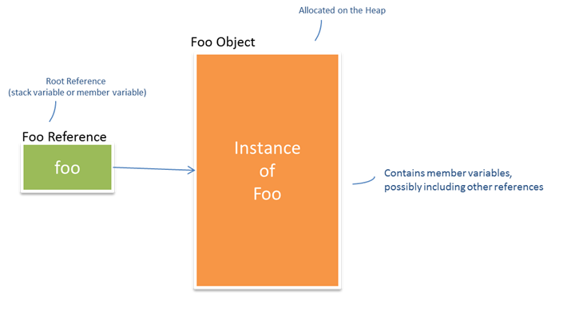
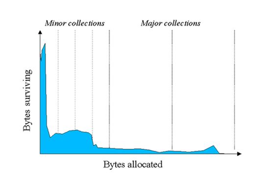

# JVM Performance Tuning – Part I


A few years ago, I had occasion to finally get to grips with the inner workings of the HotSpot JVM, specifically Java 6 and Java 7. I’d worked with Java for years and had a reasonable understanding of how memory management was handled. And, I’d spent a previous life as a C/C++ programmer so again, I had a decent understanding of heap memory management. At the time, we were in something of a bind with regard to our performance & scalability goals for our impending version release and I really needed to understand the JVM so as to tune it from both a memory size and overall performance. 


In some ways, I was fortunate insomuch as I had the time to do some thorough research and I pretty much read every guide and article out of Sun and Oracle on the topic. And when I say ‘read’, I mean ‘studied’. 

Here’s a synopsis of what I learned, which I provide in the hope that if a fellow engineer ever finds themselves in a similar bind, then what follows might save them some time and effort. 

I’ll start with basic JVM concepts before going on to cover the Memory Model, Garbage Collectors, Heap Configuration and finally, JVM Diagnostics & Tuning. 

## JVM Concepts
Here I explain the Java’s approach to managed memory, garbage collection and the design approach underpinning the HotSpot generational memory model and generation garbage collection.

### Managed Memory
Most Java programmers will understand that Java supports a ‘managed’ memory model, which means that Java automatically manages memory allocated on the heap. In other words, memory allocated by the programmer when instantiating objects (with the new operator) is automatically de-allocated by the JVM when they are no longer needed (i.e. no longer referenced). 
This contrasts with the C++ memory model where every object allocated on the heap with the new operator must be explicitly de-allocated with the delete operator.
The goal of Java here is to avoid classic memory management issues seen in languages like C++, as follows:
* Memory Leaks – memory not freed and the reference lost.
* Dangling References – Memory de-allocated before all users (threads) have finished using it.
* Confused Caller/Callee Semantics – confusion around roles and responsibilities with regard to who allocates/de-allocates memory.

By taking over responsibility, Java aims to simply avoid these issues.

Incidentally, I trust that by having a better understanding of what the JVM has to do to make this automatic de-allocation possible, it will Java programmers consider what they’re doing when instantiating objects and hence, allocating memory.

### Garbage Collection
Again, most Java programmers will be aware that it’s the Garbage Collector (GC) that responsible for cleaning up memory. Garbage is defined as those objects allocated on the heap for which there is no longer any reference pointing to it. This is sometimes referred to as ‘orphaned’ objects. 

It’s worth taking a moment to explain what goes on when an object is allocated. The following code:

```java
    Foo foo = new Foo();
```

Results in two entities coming into existence – i.e. the object on the heap and the reference variable that points to it:


 
These two entities have somewhat disconnected life-cycles in the sense that the reference can go out of scope (and be destroyed) before the object it references. However, the object can never go out of scope as long as there is at least one reference to it. 

It's the GC that’s responsible for:
* Ensuring referenced objects remain in memory. 
* Recovering memory used by objects that are no longer referenced. 

>**Note:** The above is a simple example – in reality, the reference tree can become large and convoluted, with nested references and collections of references. Some Java Profiler and Memory Analyser tools do a good job of unravelling these trees and illustrating the relationships. 

### Generational Memory Model and Garbage Collection
The key concept to understanding the nature of the GC in the Hotspot JVM is ‘Generational Collection’, which basically means that for performance reasons the GC doesn’t try to do everything in one go. The principal that underpins this approach is an observation known as ‘Weak Generational Hypothesis’ – also known somewhat unkindly as ‘Infant Mortality’. 

Basically, there is empirical evidence on OO Programming Languages that:

1.	Most objects die young (e.g. iterator objects merely exist for the duration of a single loop).
2.	There are few references held by older objects to younger objects.

The following diagram illustrates this point. 

 

_Source: [Java SE 6 HotSpot™ Virtual Machine Garbage Collection Tuning](http://www.oracle.com/technetwork/java/javase/gc-tuning-6-140523.html)_


 The upshot here is that this observation feeds into the following GC design principles:
* The HotSpot JVM adopts a Generational Memory Model.
* Consequently, the JVM applies Generational  Garbage Collection. 

What this means is that the JVM divides the Java memory model into the:
* New Generation – for which there is a minor GC collection.
* Tenured Generation – for which there is a major GC collection.

Furthermore, the JVM applies a GC ordering policy, as follows:
1.	Purge New Generation first.
2.	Purge (PermGen + Tenured) last.

The strategy being that the GC will continuously purge the Young Generation, which is typically quicker, and will only purge the Tenured Generation, which is typically more expensive, as and when it has no option. 

With this approach, the GC is able to keep on top of memory levels without adversely impacting the operation of the underlying program. As I will discuss further, certain GC policies take a ‘stop the world’ approach which means that the normal operation of the program is suspended while the GC performs its work. Of course this ‘suspension’ is not a good thing and the GC tries to avoid or minimize the effect – this is known as ‘throughput’. 

One point to note that many Java Programmers seem to be unaware of is the GC becomes active almost immediately after your Java program starts, clearing out the New Generation. It doesn’t seem to wait till the generation is full – it’s constantly at work, clearing it out. I like to make an analogy with bailing out water from a sinking boat. As long as you’re bailing faster than the water is coming in, you’ll stay afloat. Likewise, as long as the GC is clearing out unreferenced objects faster than you can allocated them, your program will stay running. Later, I’ll talk about diagnostics but when enabled, you can observe this behaviour in the logs. 

>**Note:** The New and Tenured Generations are known by several terms respectively. The New Generation if often referred to as the ‘Young Generation’ while the Tenured Generation is sometimes referred to as the ‘Old Generation’. You may sometimes see the New Generation referred to as ‘Eden’ though technically, as I’ll explain, this is really only one part of the New Generation. I will use the terms ‘New’ and ‘Tenured’ throughout.

---
Donnacha Forde

https://www.linkedin.com/in/donnachaforde/

## References
http://www.oracle.com/technetwork/java/javase/gc-tuning-6-140523.html