# JVM Performance Tuning – Part V
In this last section, I attempt to pull together the individual topics covered in the previous blogs and offer some general advice for approaching tuning and how to verify your tweaks are having the desired effect. 

Just to remind ourselves, I cover _Basic Principals_ in [Part I](./Java%20Performance%20Tuning%20-%20Part%20I%20-%20JVM%20Concepts.md), the _Java Memory Model_ in [Part II](./Java%20Performance%20Tuning%20-%20Part%20II%20-%20The%20Java%20Memory%20Model.md),  _Garbage Collectors_ in [Part III](./Java%20Performance%20Tuning%20-%20Part%20III%20-%20Garbage%20Collectors.md), and _Heap Configuration and the JIT_ in [Part IV](./Java%20Performance%20Tuning%20-%20Part%20IV%20-%20Heap%20Configuration%20&%20JIT.md). 

Here we’ll learn that, in practice, these discrete topics impact each other and that tuning is really about getting the balance right. That means that you’ll need to have an understanding of the whole, in order to be confident when addresses the specific. 

## Memory Size & GC Performance
In their guide to [Memory Management in the Java Hotspot™ Virtual Machine](http://www.oracle.com/technetwork/java/javase/memorymanagement-whitepaper-150215.pdf) (from 2006) Sun Microsystems remind us of something long-since pointed, which is that:

> “Sufficient available memory is most important factor affecting GC performance.”

And:

>“The second most influential factor is the proportion of the heap dedicated to the Young [New] generation.”

These observations still hold true. Ensuring sufficient memory is available – both for holding older objects and to ensure there is room for new objects – is the main factor affecting how your GC behaves and, in turn, how your application performs.  

## Achieving the Balance
Like any tuning effort, JVM tuning is all about achieving a balance. To help with understanding what might be perceived as conflicting goals, the following observations are worth considering:

* Minor-Collections are typically much faster (by an order of magnitude) than Major-Collections.
* Major-Collections are more likely to adversely affect observable performance, affecting start-up times and/or causing the application to pause or even appear unresponsive. 
* The JVM would seem to only resort to Major GC-cycle when it can’t clear enough memory in a Minor GC cycle. 
* A larger memory heap, with sufficient space allocated to the NewGen, can help avoid Major-Collections, though at the cost of prioritizing performance over memory usage.
* Larger generations can result in longer GC cycles. 

So, what can we conclude from this? Well, it would seem reasonable that you’ll need a large enough New-Generation so as not to have to resort to having the GC clear out the Tenured-Generation, thereby incurring the cost of a Major-Collection. New objects are allocated in the New-Generation so keeping the memory levels optimal here is key to ensuring smooth performance overall. Of course, long-lived objects will eventually be promoted from the New-Generation to the Tenured-Generation so it also follows that this generation needs to be large enough to hold these mature objects, and still leave some room for expansion. Should the JVM have to trigger a Major-Collection, then it’s likely it really does need the extra space and it’s critical that it can recuperate some memory. Often, depending on the nature and lifecycle of your mature objects, this situation may well be a short precursor to an `OutOfMemory` exception and the termination of your process. 

**Ultimately, the ideal scenario we want to achieve is to have the lower-cost Minor GC-cycle run as needed and, if at all possible, avoid the more expensive Major GC-cycles entirely.** 

### GC Behaviour in Practice
As a practical observation, you’ll find that the Minor GC-cycles kick-in very soon after the process starts, triggering quite frequently thereafter. This typically doesn’t affect throughput at all whereas you may well see your application pause when a Major GC-cycle is triggered. In fact, unless you explicitly log diagnostic info you may well never really even notice a Minor GC-cycle in effect. You may recall from [Part I](./Java%20Performance%20Tuning%20-%20Part%20I%20-%20JVM%20Concepts.md) that I made an analogy with bailing a sinking boat. While GC strategies vary, the main job is to ensure there is enough memory free to allocate new objects and keep the ship afloat. That’s really what the Minor-GC cycle is doing; clearing out stale memory (i.e. garbage objects) fast enough to make room for fresh memory allocations. It merely needs to make room for new objects before limits are reached and in this regard, GC performance has a direct bearing on memory size. 

However, all this depends on the characteristics of your application and you may well need to do some leg-work to gain that level of understanding. This is where a profiling tool can help you, not so much with the performance profiling per se but with giving you a better overview of what your application is actually doing or at least indicating which parts of the code base are actively exercised. In turn, this can help you learn what sort of objects are being allocated and from where. I like to use [JProfiler](https://www.ej-technologies.com/products/jprofiler/overview.html), a tool I selected after a short evaluation several years ago. Like all sophisticated tools, it takes a little time and effort to become familiar with and to get the full and proper use out of it. However, one factor that fed into my decision to opt for JProfiler as because I felt that it was the most intuitive profiler to use and I could quickly become effective. As an aside, I’d advise that spending the time and effort needed to understand the tool and the advanced features in particular may well dividends when you find yourself with the need to profile. 

### New/Tenured Memory Ratio
In cases where you don’t have a handle on the characteristics or behaviour of the application, you may want to consider using a trial-and-error approach to determine the optimal ratio between the new and tenured generations. Remember that, rather than configuring the size of the New Generation explicitly, you can configure it as a ratio of the Tenured Generation. 

For example, use `-XX:NewRatio=3` to do this.

This translates as a ratio of 1:3, which means that the size of the New Generation will be a quarter or 25% of the total heap. 

Note however that the New Gen grows and shrinks in correlation with the Tenured Generation, which may or may not be a consideration for you. Personally, I prefer to have more control and explicitly define the size of the New Gen, even when I’ve worked it out to be a neat fraction of the Tenured Generation.

## Garbage Collection Diagnostics
You can get the JVM to print statistics from each GC-cycle, which reveals interesting details on what the GC is doing and how it’s performing. The following JVM options will enable this:

| JVM Parameter |
| ------------- |
| -verbose:gc |
| -XX:+PrintGC |
| -XX:+PrintGCDetails |
| -XX:+ PrintGCTimeStamps |

The actual logged output will vary according to what GC policy is in use but here’s a sample of what the output looks like:

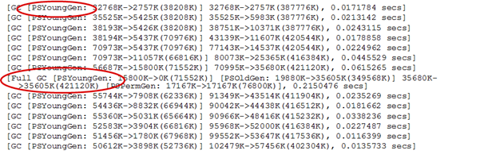
 
The first thing to note is that the log will tell you whether the GC cycle is a Minor or a Major collection. Next, it provides before and after details on memory sizes. The exact format can vary but you should be able to work out how much memory was reclaimed by the GC. Finally, it’ll report the time spent performing the GC and it’s worth comparing the scale of the Minor collections versus the Major collection. 

The log output for a full or major GC cycle is highlighted below and you can see that it reports the before and after memory levels of each of the generations. In particular, note that the major GC cycle also examines PermGen.  

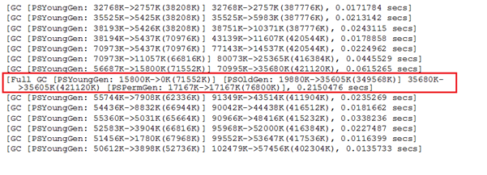

Next, let’s examine the log output from the minor collection of the New Generation. 

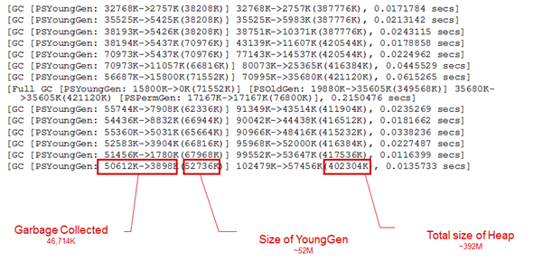

The log entries for the Minor GC cycle shows the before-and-after memory levels of the New Gen and the before-and-after levels of the full heap, which allows us to calculate the amount of the garbage collected. 

The logs also report the time taken for the GC cycle, as follows: 

The following article from Sun Microsystems (but now on the Oracle website) does an excellent job of explaining what the diagnostic entries mean and it’s worth studying it to decipher what you can gleam. http://www.oracle.com/technetwork/java/example-141412.html

### Diagnostics Analysis
By gathering these figures over time and then ‘massaging’ them into data, we can devise some key performance indicators and get an indication of how effective our GC policy and Heap-configuration actually is. (In this particular case, I manually massaged the raw data into a format that could be imported into an Excel spreadsheet but, with a little bit of effort, I’ve no doubt that the process could be automated through scripting.)

The raw data from the logs can be used to give percentage indicators, as follows: 

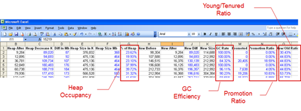

#### Heap Occupancy
Heap Occupancy lets us know how much of the heap we’re actually using, as a percentage. It can be used to help determine whether the heap is too big or too small. When tracked over a number of intervals, it can give an indication as to your application’s memory profile. (This would be merely a rough indicator and a profiler would give a more complete picture over time.)
 
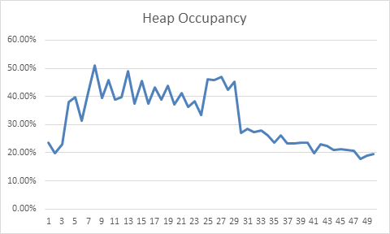

#### GC Efficiency
GC Efficiency provides an indication as to how effective the GC invocation, for each cycle. It indicates how much of the New Generation was cleared out by the GC cycle, which is a general ‘health’ indicator as it infers that the GC cycle was effective, cleared out memory and that there is no need to perform a full cycle. 

The following two graphs illustrate the same information, as bar and line graphs respectively. 

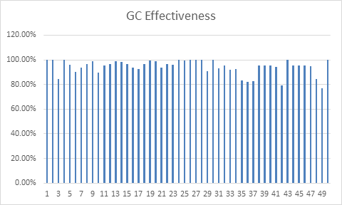
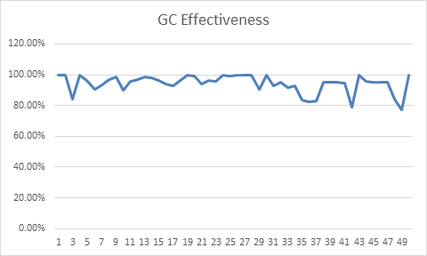

#### Promotion Ratio 
Promotion Ratio gives an indication as to how much memory, or more precisely what percentage of the heap, is being promoted to the Tenured Generation. This is calculated by subtracting the size of the ‘heap decrease’ from the change in size of the New Generation.

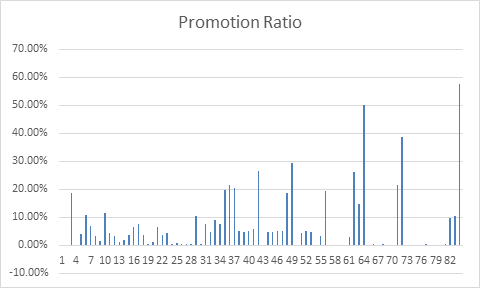

#### Young/Tenured Ratio
Young/Tenured Ratio represents the size of the New Generation as a percentage of the entire heap and gives an indication as to the relationship of new objects versus the lifecycle of ‘tenured’ objects. It can be used to help size the New/Tenured generations, relative to each other. 

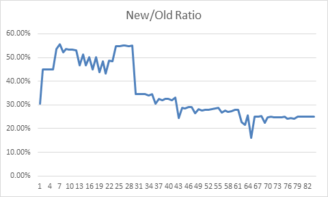

 
Collectively, these figures provide indicators as to how effective your tuning actually is. They let you know whether your heap configuration settings are roughly correct and how effective your choice of GC is. Additionally, they provide a little insight as to the behaviour of the lifecycle of the objects in your application over time. This can be an indicator as to whether you have an over-reliance on short-lived or temporary object or whether your cache (of objects) is too large for the amount of heap you’ve allocated. These indicators aren’t conclusive but can provide some clues as to where you might need to start when it comes to heap-analysis. 

### Comparative Analysis
Of course, it’s possible to contrast these data points. The following chart shows how the Promotion Ratio and the Young/Tenured Ratio look over the same time period. 

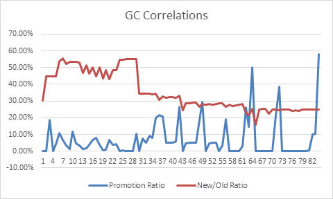 

And the following shows how Heap Occupancy and GC Effectiveness look over time. 

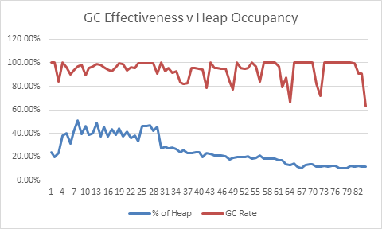 

Ultimately, these graphs merely allow us to see the diagnostics data more effectively though, in so doing, it may help spot patterns and identify where we might have to start profiling and investigating deeper. 

## Summary
The JVM diagnostics should really be used to confirm whether your hypotosis – i.e. the particular combination of GC policy, Heap Configuration settings – is actually having the effect you’re hoping for. It should be clearly understood at this point that these tweaks can impact each other and that what you’re looking to achieve is a working balance – i.e. a compromise that’s ‘good enough’. Use the diagnostics to check that by achieving the results in one area, you haven’t created a problem in the other. 

I feel it only fair to point out that there are limits to what you can achieve here. While my investigations have left me convinced that you can nearly always improve on the default JVM settings, the scale of the improvements are likely to be relatively small. If your application ‘runs like dog’ (performs poorly) to begin with, then no amount of tweaking is going to turn it into a racehorse. Ultimately, you may have no choice but to look at the fundamental design of the application. In this case, all you can hope for from the diagnostics is perhaps an indication as to where the issue starts to show. Then again, that will likely only be a symptom of an underlying flawed design. In my case, it was just enough to get us over a hurdle in the short-term.

Java is great programming environment but, in insulating programmers from the mechanics, many Java programmers have little-to-no understanding of the effects of their code at the machine level (JVM). Performance is often an afterthought. And, it can incredibly difficult to retrofit performance into an application. 

Equally, as often quoted _“premature optimization is the root of all evil”_ and we do a disservice to our coding when our brains are preoccupied with the minutia of the performance of each line of code. Instead, a balance is required and I’d advise that Java programmers regularly run their code under a profiler, just to keep on top of things, to flag issues early and to help them understand the wider context. 

---
Donnacha Forde

https://ie.linkedin.com/in/donnachaforde

## References
http://www.oracle.com/technetwork/java/example-141412.html

http://www.oracle.com/technetwork/java/javase/memorymanagement-whitepaper-150215.pdf

http://stas-blogspot.blogspot.co.uk/2011/07/most-complete-list-of-xx-options-for.html

http://www.oracle.com/technetwork/articles/java/vmoptions-jsp-140102.html

