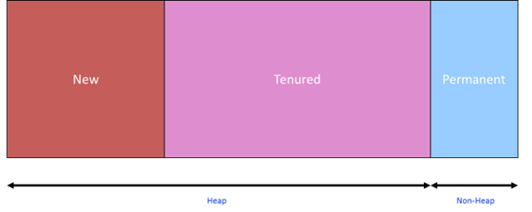
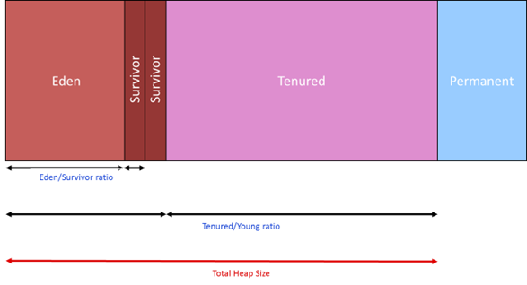
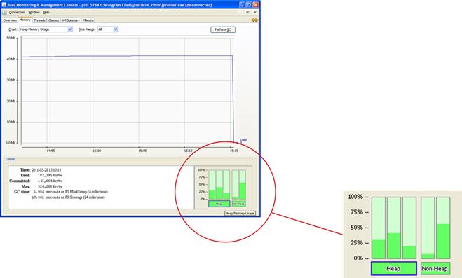
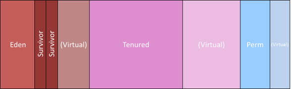
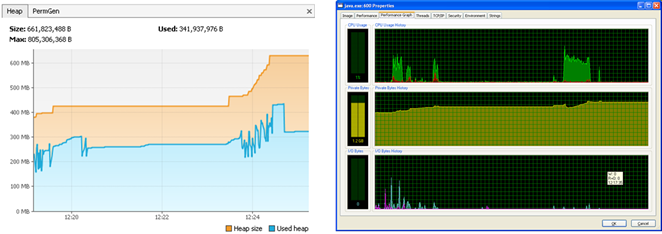

[home/](https://donnachaforde.github.io)[blogs+posts/](https://donnachaforde.github.io/blogs+posts/)[jvm-performance-tuning/](https://donnachaforde.github.io/blogs+posts/jvm-performance-tuning/)[java-memory-model](./java-performance-tuning-part-ii-the-java-memory-model)

# JVM Performance Tuning – Part II

Now that we have the principal concepts out of the way in [Part I](./java-performance-tuning-part-i-jvm-concepts), I’d like to explain the _Java Memory Model_, which is a fancy way to describe how the JVM views the world. 

## Table of Contents
1. [JVM Memory Layout](#jvm-memory-layout)
2. [New Generation](#new-generation)
3. [Tenured Generation](#tenured-generation)
4. [Permanent Generation](#permanent-generation)
5. [Eden & Survivor Spaces](#eden--survivor-spaces)
6. [JVM Memory Pools](#jvm-memory-pools)
7. [Notes on Memory Nomenclature](#notes-on-memory-nomenclature)
    - [Memory Ratios](#memory-ratios)
    - [Committed versus Virtual Memory](#committed-versus-virtual-memory)
    - [Java Memory versus Actual Memory](#java-memory-versus-actual-memory)

## JVM Memory Layout
In broad terms, JVM memory is often referred to in terms of _Heap_ and _Non-Heap_. Heap memory consists of the _New Generation_ and the _Tenured Generation_, as explained in [Part I](./java-performance-tuning-part-i-jvm-concepts). The non-heap consists of _PermGen_ – i.e. _Permanent Generation_.

The following diagram illustrates the layout: 

## New Generation
This is the heap-location for new objects. It is regarded as the ‘Speed Efficient’ generation and will contain lots of garbage objects. It is typically smaller than the Tenured Generation, usually set at one-quarter the size of the Tenured Generation, which helps make the GC cycle faster. 

The GC cycles for the New Generation are referred to as _Minor GC Cycles_ and they occur much more frequently than GC cycles on the Tenured Generation. As the name suggests, Minor GC Cycles of the New Generation are typically much faster than the Major GC Cycles of the Tenured Generation, which facilitates much shorted ‘pause times’. 

Generally, your Java application is ‘paused’ while the GC does its job. However, you typically won’t even notice a minor GC cycle in operation. 

## Tenured Generation
This is the heap-location for older objects and it is regarded as the ‘Space Efficient’ generation. It is typically larger than the New Generation, occupying most of the heap. 
The GC cycles for the Tenured Generation are referred to as _Major GC Cycles_. They are much more expensive than GC cycles on the New Generation and should occur much less frequently. I say ‘should’ here because frequent invocation of major GC cycles likely means your application is in trouble. 

> **Important**  
> The JVM will only resort to a major GC cycle when the minor GC cycle fails to free up enough memory. Logically, if the objects residing in the Tenured Generation truly are long-lived, then the GC cycle here won’t free up much memory. I’ve typically seen the GC make a few attempts before firing an `OutOfMemoryException` and killing the application. 

## Permanent Generation
This is known a ‘PermGen’ and is typically much smaller than both the New and Tenured Generations. It’s used to hold code-pages and Java classes. It also subject to GC cycles and it’s worth noting that PermGen is collected before the Tenured Generation and that it is collected serially. For the most part, it’s pretty insignificant unless your application makes extensive use of `Reflection`. In which case, you may well need to adjust the sizing. 

For many Java developers, the PermGen is a bit of a mystery. For others, especially those that use reflection, it’s important to understand that the JVM has an internal representation of Java classes, as well as objects. _Jon Masamitsu's Weblog_ does a good job of explaining what it does here: https://blogs.oracle.com/jonthecollector/entry/presenting_the_permanent_generation.

> **Warning**
> 
> In Java 8, the concept of PermGen has been removed and a different approach to managing all the ‘metadata’ contained therein has been introduced. See the following article for details: http://www.infoq.com/articles/Java-PERMGEN-Removed. 

Originally, there was no separate space for PermGen and objects and classes were stored together. Apparently, a dedicated PermGen was desirable for certain GCs so it’s somewhat ironic that the latest version of Java (JDK 8) has done away with the dedicated generation.

## Eden & Survivor Spaces
The New Generation is subdivided into a space called ‘Eden’ + 2 x ‘Survivor’ Spaces. Eden is where new objects are created though, on exception, large objects may be created directly in the Tenured Generation.  

Survivor spaces are used by the GC to cache and promote objects during GC cycles. An object is regarded as a ‘survivor’ if it is not garbage-collected and, in turn, survivor-objects that survive N number of GC cycles get prompted to the Tenured Generation. So, you can think of Survivor spaces as staging posts between GC cycles and logically, you need two to effect a promotion to the Tenured Generation. Naturally, objects promoted out of the New Generation to the Tenured Generation are not considered in the next minor GC cycle. So, in a sense, promoting objects is effectively a way of putting them in longer-term cache to avoid the cost of dealing with them when managing the memory in the New Generation, which of course is the most frequently processed generation. 

Note that the GC toggles the purpose of the two Survivor Spaces. On each iteration, it stores new GC-cycle ‘survivors’ and uses the other  Survivor Space as a staging area for promoting objects to the Tenured Generation.

## JVM Memory Pools
If you’re curious, you can take a peek at these various memory sections in action by using the `JConsole` tool that comes with the JDK install. 

> **Tip**
> On Windows, look for `jconsole.exe` usually located under `C:\Program Files\Java\<jdk version>\bin`

 
It shows Tenured Generation, Eden Space, Survivor Space in the heap section and Code Cache and PermGen in the non-heap section.

As mentioned above, the layout has changed for Java 8 so you’ll notice a slight variation in the non-heap layout, showing Metaspace, Code Cache, Compressed Class Space.

## Notes on Memory Nomenclature
There are a few other concepts worth understanding.

### Memory Ratios
Occasionally, you’ll see reference to the memory layout in terms of ratios. The diagram above illustrates two such important ratios:
* Eden/Survivor ratio
* Tenured/Young ratio

We’ll encounter these terms later when we talk about configuring memory sizes. 

### Committed versus Virtual Memory
Another concept to get clear in your mind is the difference between the memory that has been committed or used versus the memory that has been ‘virtually’ committed. The JVM effectively maintains a buffer of memory that it can assign that is larger than what is currently used. 

For each generation, there is virtual space occupied but not yet allocated, as illustrated here: 

Consequently, the memory being used by the JVM will likely be larger than the memory used by your Java application.

### Java Memory versus Actual Memory
This is a constant source of confusion so it’s worth getting this straight in your mind. Everything discussed thus far relates to Java memory – i.e. memory controlled by the JVM. However, the JVM is a process running on the Operating System (OS) that itself consumes memory so the ‘actual’ memory footprint – i.e. the amount of actually memory used on the host – will always be larger than what the Java process consumes. 

Additionally, if your Java process used the Java Native Interface (JNI) to interact with a C library, then any memory occupied by the DLLs making up that library will contribute to the actual memory size, but will not count against the JVM memory. 

The following diagram shows both the ‘Java’ perspective on memory consumption and the ‘actual’ memory consumption (using the ProcessExplorer SysInternals tool ).  

On the left-hand-side, we can see a Java process that is currently using ~325 MB though ~630 MB has been allocated by the JVM. On the right-hand-side, we can see the ‘actual’ memory used to run this program, with the figure of 1.2 GB also accounting for memory used by the JVM, plus memory allocated in libraries bound by JNI. The points to note are:

1.	The JVM will always have allocated more memory than what is currently being used. 
2.	The Java process running the JVM will always consume more memory than the Java process it executes. 

The size of the JVM will vary according to the implementation you’re using, whether you’re operating on a 32-bit or 64-bit OS and whether you link with any DLLs. 

In my [next blog](./java-performance-tuning-part-iii-garbage-collectors), I’ll explain Garbage Collectors, Memory Sizing and the JIT Compiler.

---
_Donnacha Forde_

_[linkedin.com/in/donnachaforde](https://www.linkedin.com/in/donnachaforde/)_/

---
_See [Part V](./java-performance-tuning-part-v-jvm-diagnostics) for article references._
