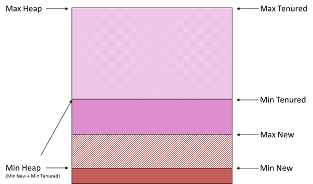
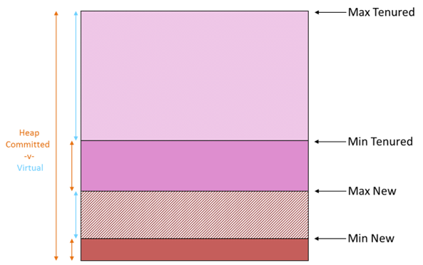
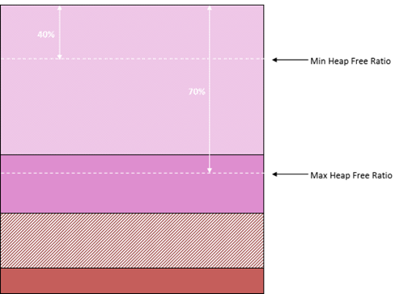

[home/](../../)[blogs+posts/](../)[jvm-performance-tuning/](./)[jvm-heap-config-and-jit](./java-performance-tuning-part-iv-heap-configuration-and-jit)

# JVM Performance Tuning – Part IV
In this section, I discuss Heap Configuration and the Java Just-in-Time compiler (JIT) , building upon previous blogs covering principal concepts in [Part I](./java-performance-tuning-part-i-jvm-concepts), the Java Memory Model in [Part II](./java-performance-tuning-part-ii-the-java-memory-model) and Garbage Collectors in [Part III](./java-performance-tuning-part-iii-garbage-collectors). 

 

## Table of Contents
1. [Heap Layout & Sizing](#heap-layout--sizing)
2. [Stack Size](#stack-size)
3. [JIT Compiler](#jit-compiler)

## Heap Layout & Sizing
In [Part II](./java-performance-tuning-part-ii-the-java-memory-model) I describe how Java organizes memory so we understand that the HotSpot™ VM adopts a generational approach to organizing memory. From [Part III](./java-performance-tuning-part-iii-garbage-collectors), we understand that the GC tackles garbage collection differently in each of the memory generations, even to the point where we can configure different garbage collectors for the New and Tenured generations respectively. 

An interesting point to note is that most monitoring tools display memory levels in a single graph – which is a good thing – but you should understand that memory levels are going to alter independently in each of the generations. (The Java Console tool does actually show a graph illustrating the memory levels of each memory section.) The following diagram is somewhat confusing but it attempts to illustrate this point, and show where some of the terms referencing limits and ratios apply. 

To help with this, I’ve effectively turned the diagrams in [Part II](./java-performance-tuning-part-iii-garbage-collectors) on-end, which showed memory laid out from left-to-right, to show the layout from bottom-to-top. 

 
At the bottom, the diagram shows the amount of _memory used_ plus the _memory allocated_ in the New Generation. Above this, the diagram shows the amount of _memory used_ plus the _memory allocated_ in the Tenured Generation. 

You may well see references to the amount of _memory committed_ versus the amount of _virtual memory_. Memory allocated by the VM but not yet used by the application is referred to as _virtual_. It is memory that’s been assigned to the application but has not yet been used by the application and essentially represents the amount of memory in reserve for the application, without the JVM having to extend the heap further. 

 
The total amount of memory taken by the VM (from the OS) is referred to as _committed_ and represents the sum of memory actually used by the application plus the memory allocated (or reserved) for the application.  The term _committed_ here can be a little bit confusing so I find it helps to consider that the JVM is just another application running on the OS that assigns blocks of real memory. In turn, the JVM acts, well, like a VM or OS and assigns memory as requested by the application, ensuring there is a reserve that’s _allocated_ though not yet used. From the perspective of the OS, that memory is _committed_ to the JVM. 

The _Max Heap_ is a limit value representing the absolute maximum amount of heap memory that the JVM can consume and assign. Typically, the size of the Committed Heap will start off as less than the Max Heap though it’s quite permissible for the JVM to have the Committed Heap equal to the Max Heap. In fact, it’s recommended in some cases where applications are sensitive to start-up time and have an aggressive memory allocation profile at this point.

The _Min Heap_ is a limit value representing the minimum amount of Heap Memory the JVM can allocate. Remember that allocating memory comes as a cost so it’s important to understand that the min heap should be large enough to run your application. In other words, it’s a helpful instruction to the JVM on where it needs to start. 

At a finer level of granularity, you may see mention of _Max New Heap_ and _Min New Heap_ and similarly, _Max Tenured Heap_ and _Min Tenured Heap_. This is merely a way to refer to Max and Min heap sizes within the context of a specific generation.

The following diagram illustrates yet another way to consider heap sizes. 

 
The _Max Heap Free Ratio_ is merely a way to express the maximum amount of memory available (but not allocated) as a percentage of the total committed. Similarly, the _Min Heap Free Ratio_ is merely a way to express the minimum amount of memory that, as percentage of the total committed, should be available. Both of these ratios are used to instruct the JVM as to how it should behave when allocating and de-allocating memory ahead of or after demand. Clearly, some common sense needs to prevail when specifying these as they essentially refer to the size of _virtual memory_ and can have a direct impact on when the heap is extended or contracted. 

## Stack Size
While it may seem obvious at first, _Stack Size_ can affect the overall memory size of Java applications, in particular where there are a large number of threads operating, as is often the case with ‘server’ style Java applications, especially with larger ‘monolithic’ servers. 

The significant point to note is that stack-size is universal – it’s applied to all threads in the application, regardless of whether they’re the particular thread (or group of threads) that require a larger stack. 

To illustrate the point, say your large-scale, enterprise server application utilizes 100 threads. Clearly then, every 256K increase in stack size results in an overall increase of 25MB in total memory consumption. Now, admittedly this was more of an issue when deploying on 32-bit platforms than 64-bit but it’s worth bearing it in mind when you’re strapped for memory space. 

Note that the default stack size varies according to platform, architecture and release. Regardless, an insufficient stack size will simply result in a StackOverflow crash. Often, this can be as a result of recursion or the need to traverse large tree/graphs (using recursion) so it’s often the case that it’s just in the one place and hence one thread that encounters this sort of issue. The quick fix is to increase the stack size but when things are tight, you may have to reconsider how the code operates to see if a less stack-intensive solution can be deployed. 

## JIT Compiler
Most Java programmers understand the role and purpose of the _JRE (Java Runtime Environment)_ and that their Java code gets compiled into ‘bytecode’ that’s interpreted at runtime. This aspect of Java attracted a lot of criticism in the early days when compared to performance of native binary, compiled from, say, C++ code. Enter the JIT – the Java _‘just-in-time’_ compiler – an aspect of the JVM that converts bytecode into native code at runtime to achieve performance levels equivalent to natively compiled code. 

The key to understanding this aspect of the JVM is:
* All code starts out as bytecode but can be compiled into native code when certain thresholds are achieved.
* There is a cost to performing the JIT compilation. 

Basically, the JIT kicks in when a code section executing count exceeds a certain threshold and this can impact start-up time. For applications with a sensitive start-up period, it may make sense to increase this threshold to put off the JIT compilation costs. Alternatively, you could opt to pay that cost up front and gain the benefit over the lifetime of the program. The following JVM options allow you to customize JIT behaviour. 

| Parameter | Effect |
| --------- | ------ | 
| -XX:CompileThreshold=300000 |	Delay JIT being triggered. |
| -XBatch	                  | Perform JIT Compilation in foreground. | 

In my [next and last blog](./java-performance-tuning-part-v-jvm-diagnostics) in this series, I’ll discuss JVM Diagnostics and will illustrate how to work with the JVM to test and verify whether your tuning effects are having the desired effect. I’ll also show you how, with a little bit of grunt effort, how you can visualize and interpret diagnostic information to a greater level of depth than many profiling or memory monitoring tools. 

---

_Donnacha Forde_

_[linkedin.com/in/donnachaforde](https://www.linkedin.com/in/donnachaforde/)_

---
_See [Part V](./java-performance-tuning-part-v-jvm-diagnostics) for article references._

