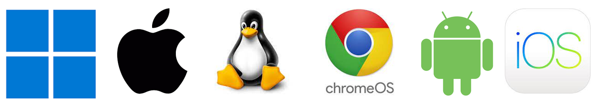

[home/](../../../)[blogs+posts/](../../)[software-engineering/](../)[wouldn't-start-here](./)

# Well, I wouldn’t start from here…

### _Abstract_
_The fragmentation of the traditional target platforms for AV vendors, because of the increased diversity of endpoint OS and underlying processor architecture, in recent years means that the engineering mechanisms and organizational structures that have evolved over decades may not serve us as well into the future. We must consider the underlying architecture design of our endpoint solutions to determine whether they are fit for purpose for the coming years. Breaking down product silos and drawing a distinction between those parts of our solutions that are entirely platform specific and those that are generic is perhaps the first step towards adopting a more modular approach and ultimately, even a ‘microservices architecture on the endpoint’, which may well facilitate more effective and more efficient software development of endpoint security solutions._

## Introduction
"Well, I wouldn't start from here..." So goes the old joke about giving directions to tourists. Perhaps something similar could be said of Endpoint Architecture in cybersecurity solutions because what we typically have today are as a result of evolution, not necessarily planning. If you were tasked with designing an architecture to support what's needed today, chances are what you'd design would differ greatly than what we have today. In other words, you wouldn't want to start from here... but of course, that is the reality for many AV vendors.

There are two related factors at play here:

1. AV solutions have been historically weighted towards Windows more than any other OS.

2. The target market for Endpoint has fragmented.

Let's examine these in a bit more detail. 

## Wintel Weighting

There are several reasons why anti-malware solutions are disproportionally more sophisticated on Windows, specifically on Intel processor architecture, than any other desktop/laptop OS. 

1. Malware has predominantly targeted Windows because it has the largest user-base and has had been for quite some time.

2. Achieving protection parity across heterogeneous OS is a misconception.

3. Historic organizational structures prohibit cross-platform collaboration. 

### Malware has Disproportionately Targeted Windows

To a large extent, the _Malware business_ is a numbers game and as malware authors need their malicious software to actually be triggered, they target the largest user base to maximize the probability of that happening. The greater the number, the greater the chances of achieving their goal. It's no surprise then that most malware targets the family of Windows OS, more specifically Windows on Intel Architecture (i.e. Wintel).

A corollary to that is that the _Antimalware business_ is demand-lead and the attention, expertise and resources contained therein has to focus on the greatest threats. It could be argued that historically, the main focus for the longest time has been on Endpoint Protection, with the richest feature set specifically targeting Windows. It comes as no surprise that the supporting infrastructure, Engineering, Research Teams, etc. underpinning those features has the greatest depth of expertise on Windows, developed and honed over time as a consequence of uncovering and understanding the tactics and techniques employed by malware authors as both parties play out a _cat-and-mouse_ game of evasion and detection. 

The upshot is that because malware has predominantly targeted Windows, that's where the greater part of antimalware resources are focused.

> **Note:** Even today, some 10+ years since 64-bit machines became commonplace, the vast majority of malware samples are Windows x86 binaries (i.e. 32-bit).

### Protection Parity is a Misconception
There's customer-led demand to achieve closer parity in endpoint protection across desktop OS. In practice, this usually means parity between Windows and macOS because Linux on the desktop is comparatively niche. Apple's inroads into the enterprise desktop and laptop space over the last decade or so has rendered customers seeking a more uniform solution that provides protection in some equal measure across Windows and macOS. This is a grey area because most protection features are tightly-coupled to the underlying OS or shore-up a vulnerabilities specific to the OS. Windows and macOS are fundamentally different operating systems so protection mechanisms built for Windows most likely just won't map directly to macOS because the underlying constructs in the two OS are different. 

On the other hand, it’d have to be acknowledged that certain features available today targeting Windows are not available on macOS for other reasons, which have more to do with the dynamics of staffing and resources. Given the extent of the knowledgebase within an organization on Windows, it’s understandable when we see an innovative features emerge for Windows but then don’t immediately see the equivalent for macOS or even Linux. That, in part, relates to the availability of talent, the depth of experience internal to the organization and therefore, the extent to which it can innovate on other endpoint platforms.  

Of course, internal resource allocation reflects market-share directly and with Windows still dominating ~70-80% of the desktop/laptop market, it's easy to infer where most of the Research, Engineering and Operations resources will be focused. (Note: macOS has somewhere between 7.5-20% depending on which stats you look at – see references below). With relatively fewer resources allocated to macOS, Linux (even just focusing on the main distros) and more recently, ChromeOS, you can begin to understand why it becomes a challenge to achieve ‘parity’. The smaller, less-well resourced teams simply cannot achieve the same delivery velocity.

### Organizational Evolution
Another factor that affects organizational structure is the evolution of engineering organizations over time. Unlike products originally intended to sell across platforms from the get-go, security solutions have historically tended to start with Windows, then get replicated on macOS or other platforms. I say ‘replicated’ because the evolution of those organizational structures practically prohibits porting code across platforms. 

For example, if an engineering team starts a project initially targeting the Windows platform then, even if they’re using a programming language that lends itself to portability (e.g. C/C++), unless there is an overarching design philosophy to produce portable code, it’s quite difficult to develop code and libraries that don’t just become ‘polluted’ with OS specific constructs. By and large, compiler vendors are the same entity as the OS vendors and they seem to do their best to lock you in to developing for their platform alone. You have to work pretty hard and take proactive measures to ensure your C/C++ code, their dependencies and your build-system are cross-platform compatible. You may likely have to pass up on using attractive platform specific features. 

Given where many AV companies have come from, it’s practically impossible to retrospectively adapt their solutions stacks to be portable. I should clarify that the context here relates to all the code that ‘could’ be common across platforms. For the most part, this is everything other than the ‘business logic’ of protection itself because, as we’ve discussed, that’s more often tied to the underlying OS. So, we’re talking about pretty much everything else, which might be categorized as supporting services (e.g. telemetry, logging, licensing, policy enforcement, version control, content updates, etc.). 

The upshot is it seems that AV vendors, perhaps more than other software houses, end up with discrete engineering teams supporting Windows, macOS and Linux, without any shared components. Here, [Conway’s Law](https://en.wikipedia.org/wiki/Conway%27s_law) makes its presence felt and the challenge of achieving protection parity clearer. 

## Target Market Fragmentation
At one time, an AV vendor could afford to target a Windows-only solution and be assured that they had a significant market presence. Today, however, macOS has made a significant inroad into the enterprise desktop market. Linux and even ChromeOS are further eroding this dominance. Mobile and tablet devices are ubiquitous as both accompaniments to existing laptop users or as a way to distribute an electronic device to non-traditional computer users. The upshot is that if an AV vendor wants to meet their customers’ needs and provide a single-vendor solution, then they have to spread their resources and talent-pool across a greater number of heterogeneous platforms and development environments/paradigms. 

### MacBooks & Chromebooks
The traditional PC laptop market has been eroded on the higher-end by Apple MacBooks and on the entry-level by Chromebooks, although Chromebooks are more recently targeting the high-end market as well. The point is that both large enterprises and SMEs are demanding cross-platform solutions, more typically across Windows and macOS along the lines of a 90:10 or 80:20 split. 

### Mobile & Tablet
The proliferation of mobile devices for use in a professional capacity, either as an accompaniment to or in place of a laptop, with the access to the same data and resources as a traditional endpoint device means that the threat landscape has changed significantly. Today, there is an expectation that your AV vendor can provide a comprehensive suite of solutions for all their devices. Customers prefer to deal with a single vendor here. 

From a logistics point of view, the mobile device market appears to have largely settled on iOS and Android, which means that engineering organizations can address the mobile market with just two sets of engineering teams. However, subtle differences between, for example, iOS and iPadOS could complicate development, build and QA, etc. 

### Chromebook
By and large, Chromebook seems to have been lumped into the Mobile/Tablet space, most probably because ChromeOS provides sandboxed subsystem support for Android. Most software vendors claiming support for ChromeOS do so by merely rebranding  their Android solution to this platform. However, barring a few noticeable exceptions, Android apps on ChromeOS run entirely within the Android sandbox and so do nothing to protect the other sandboxes hosted on the machine or the ChromeOS sandbox itself. They can really only offer protection within the sandbox for other Android apps, which is actually required because the Google Play Store isn't infallible and it's possible for malicious apps to make it past their checks. 

Chromebooks have captured significant market share in certain industry sectors and again, customers seek comprehensive solutions from their preferred vendor. 

### arm64
The expected market adoption of arm64 processors across Windows and macOS further exacerbates the challenge of providing uniform solutions. There are technical differences across the platforms that determine how an engineering organization handles these platforms but, at least for Windows, full native support involves a significant investment across engineering, quality assurance and build & release that is unlikely to see a return for several years until such time that market adoption reaches a critical mass. There are imminent challenges for traditionally Windows-targeted organizations as Microsoft Surface devices have adopted arm64 and the main hardware vendors are gearing up to meet an expected ~25% market share. Apple have already adopted Apple Silicon M1 and M2 processors (their version of ARM) as standard across their MacBook Pro and MacBook Air ranges. 

The upshot is that in order to sell your product today, you have to deal with a more fragmented target platform, be that a different processor architecture or different OS. 

## Summary
The challenge today for AV vendors is that the ground has shifted under our feet. Where once a Windows-only solution might have been sufficient for the majority of customers, the steady rise in the adoption of MacBooks coupled with the more niche deployment of Linux variants plus the rapid adoption of Chromebooks, particularly in educational settings, and the proliferation of mobile devices means that providing a holistic solution to customers requires greater effort all round, across product management, engineering, threat-research, quality-assurance, etc. Understandably, customers want to engage a single vendor for their entire deployed base, be it a mix of Windows, macOS, ChromeOS, Linux, iOS and Android.  

The upshot from the protection-provider’s perspective is that the entire organization has to be geared up to bring products and solutions to market across these platforms. Where once there was a single target platform – and as a consequence, a single testbed, a single build & release platform, there are now multiple. 

The overarching question then must be whether endpoint architecture  has a part to play in influencing the design such that code production, maintenance and field support can be made easier and more cost-effective. Today, we pretty much entirely have a ‘shared nothing’ model due to the way the field has evolved. As discussed, considerable parts of any AV solution have to be ‘shared nothing’ due to the nature of the problem domain and target platform but does that mean we can't have a ‘shared something’ model?

***
Donnacha Forde
_February 2024_

_[linkedIn.com/in/donnachaforde](https://www.linkedin.com/in/donnachaforde)_

## References
* ARS Technica - _[The word's second most popular desktop operating system isn't macOS anymore.](https://arstechnica.com/gadgets/2021/02/the-worlds-second-most-popular-desktop-operating-system-isnt-macos-anymore/)_

* Global Stats statcounter - _[Desktop Operating System Market Share Worldwide](https://gs.statcounter.com/os-market-share/desktop/worldwide/)_

