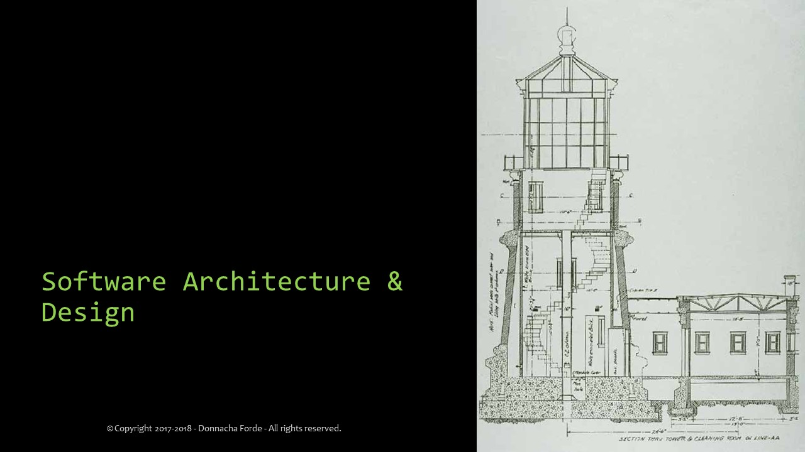

[home/](https://github.com/donnachaforde/donnachaforde.github.io)[lectures](https://donnachaforde.github.io/lectures/)

# Lectures on Software Architecture & Design
 University Lectures at masters-level delivered at [Munster Technology University](https://www.cit.ie/index.cfm) (MTU)  as part of an [MSc program in Software Architecture & Design](https://cs.cit.ie/sad). 

> **Note** MTU was formerly Cork Institute of Technology (CIT)

I developed the course material over the summer of 2017 and delivered it in Q4 2017 and again in Q4 2018 (with minor revisions). The order of the lectures is relevant insomuch as lectures 02-04 are foundational and used to provide context for the rest of the course. The exact running order of the remaining lectures varied a little to accomodate logistics and guest speakers but the following reflects how the course progresses over the semester.

---

### Lectures

 **Note:**
_The following links reference PDF docs._

1. [The Role of the Architect](published/01%20-%20The%20Role%20of%20the%20Architect.pdf)

	After introducing the course, I cover how the role of the _Software Architect_ emerged in industry, describe what the role entails and why it's so important. 

2. [Middleware & Interprocess Communication](published/02%20-%20Middleware%20%26%20Interprocess%20Communication.pdf)

	In this lecture, I cover interprocess communication and explain the mechanics from sockets to RPC and beyond. Understanding computer networks and having an appreciation for middleware is at the core of understanding client/server, cloud and distributed systems design.  

3. [UI Architecture](published/03%20-%20UI%20Architecture.pdf), UI Infrastructure & Web Frameworks (co-presented with Guest Speaker)

	Here, I introduced the subject of UI Architecture in broad terms before co-presenting on UI Infrstructure and Frameworks with my guest speaker. 

4. [An Introduction to Database Modelling](published/04%20-%20An%20Introduction%20to%20Database%20Modelling.pdf)

	In this talk, I give an introduction to structured design and entity modelling that underpins good database design. 

5. [Databases & Persistency](published/05%20-%20Databases%20%26%20Persistency.pdf)

	I cover how SQL-Server databases emerged in the '80's and '90's to become central to most modern applications before going on to examine non-SQL databases. I also take a look at distributed-database architecuture, two-phase commit and database replication.  

6. [A Quick Recap on Object-Oriented Design](published/06%20-%20A%20Quick%20Recap%20on%20Object-Oriented%20Design.pdf)

	I quickly recap on the principals of OO as a precursor to my next talk on Spring.

7. [An Introduction to Spring, DI & IOC](published/07%20-%20An%20Introduction%20to%20Spring%2C%20DI%20%26%20IOC.pdf) 
	
	In this talk, I introduce the Spring Framework, starting with the principals of Dependency Injection (DI) and Inversion of Control (IoC), explaining how this affects object-oriented design. I go on to use a simple example to illustrate design influences and explain the relevance of very late dynamic binding. 

8. [Server Infrastructure & Enterprise Services](published/08%20-%20Server%20Infrastructure%20%26%20Enterprise%20Services.pdf)

	This lecture covers enterprise development and how evolving frameworks provide similar, if not the same, services. I also look back at older technologies like COM and CORBA and examine why today, we are focused on REST and HTTP protocols. 

9. [Messaging & Event-Driven Architecture](published/09%20-%20Messaging%20%26%20Event-Driven%20Architecture.pdf)

	In this talk, I provide an overview on messaging as an IPC mechanism, contrasting it with Client/Server communication. I examine messaging characteristics before going on to discuss Messaging/Notification models in the enterprise space and the common event-channel models we see in several implementations. 

10. [The 'Third Platform' - Cloud & Big Data](published/10%20-%20The%20Third%20Platform%20-%20Cloud%20%26%20Big%20Data.pdf)

	I discuss architecting for modern, enterprise platforms and examine how the cloud, mobile devices, social and 'Big Data' converge to describe the 'Third Platform'. 

11. [Architecting for the Internet of Things](published/11%20-%20Architecting%20for%20the%20Internet%20of%20Things%20(IoT).pdf)

	In this short talk, I introduce IoT from an architect's perspective and propose how a tiered abstraction model helps us deal with the complexity in this domain and satisfy the needs of the various stakeholders. 

### Guest Speakers
There was an emphasis on industry contribution for this MSc course and, in keeping with that sentiment, I invited guest speakers from industry to gave a talk on their subject matter expertise.

1. UI Infrastructure & Web Frameworks (Guest Speaker - [Elaine Holland](https://www.linkedin.com/in/elaine-holland-b10b8b225/), EMC)
1. Microservices Reference Architecture with NGINX (Guest Speaker - [Peter Kelly](https://www.linkedin.com/in/peterkellyonline), NGINX)
2. Cloud Antipatterns with Pivotal Cloud Foundry (Guest Speaker - [Tammer Saleh](http://tammersaleh.com/), Pivotal)
3. Architecting for Scale with McAfee (Guest Speaker - [Pat Lynch](https://www.linkedin.com/in/pat-lynch-59b6b31), McAfee)

> **Note** Company associations correct as of the time the talk was delivered. (2017-2018).

---
Donnacha Forde

[linkedin.com/in/donnachaforde](https://www.linkedin.com/in/donnachaforde/)

