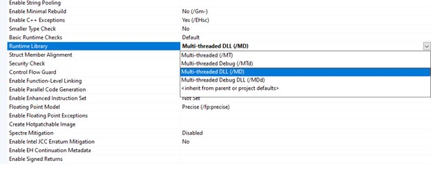

# Hard-won Lessons: Don’t ignore compiler warnings…

Don’t ignore compiler warnings unless you’re absolutely sure why you’re ignoring them. Yeah, there are some warnings that fall into the category of nuisance information but many are there for good reason. Or, at the very least, can give you a small clue about potential issues with your environment. 

## Example
Let me give you an example, I was exploring using gRPC on Windows and wanted to understand the build requirements for working with (just) Visual Studio. gRPC itself and its example code are built using CMake (and in turn Visual Studio) but I needed to understand the raw building-block settings to that we could create a Visual Studio project from scratch. And, given I’d put considerable effort into building both gRPC C++ and the C++ examples from source, I figured I was in a good place. After all, I had working examples. 

Apart from learning the build settings, I also wanted to simplify the example code, stripping it down to its minimal code. 
I managed to figure out the build steps for generating and building the stub code and I managed to build the client okay, albeit with some instances of compiler warning: C4251 https://docs.microsoft.com/en-us/cpp/error-messages/compiler-warnings/compiler-warning-level-1-c4251

Still, the client compiled okay. 
When it came to the server code though, I hit several errors. 


#


Having completed both a vcpkg install and a build-from-sources install, I ended up with two sets of #include header files and libraries. In fact, when you install gRPC, you also implicitly install Google’s protobuf so I had two sets of these as well. In the case of the manual build-and-install, the protobuf headers and libs get installed into the same include directory as gRPC. However, in the case of vcpkg, it places them in their own location (under both directories ‘packages’ and ‘installed’). 

When comparing the gRPC installs, it was clear that they were different versions. This is to be expected though as while I built the latest stable release version from source, the version available on vcpkg is maintained separately by Microsoft team members and community collaborators and is likely just a little older. 
gRPC is most typically used with Google protobuf, which is conceptually a separate technology but is installed along with gRPC. 
When comparing the header files for protobuf, I discovered a small but significant difference is just one header file – i.e. protobuf\stubs\platform_macros.h
The version installed by vcpkg contained the following definition:

```
#ifndef PROTOBUF_USE_DLLS
#define PROTOBUF_USE_DLLS
#endif // PROTOBUF_USE_DLLS
```

In turn, if `PROTOBUF_USE_DLLS` is defined (and we’re using Visual Studio), then DLL import/export definitions are defined in what is a standard manner. 

```
#if defined(PROTOBUF_USE_DLLS) && defined(_MSC_VER)
# if defined(LIBPROTOBUF_EXPORTS)
#  define PROTOBUF_EXPORT __declspec(dllexport)
#  define PROTOBUF_EXPORT_TEMPLATE_DECLARE
#  define PROTOBUF_EXPORT_TEMPLATE_DEFINE __declspec(dllexport)
# else
#  define PROTOBUF_EXPORT __declspec(dllimport)
#  define PROTOBUF_EXPORT_TEMPLATE_DECLARE
#  define PROTOBUF_EXPORT_TEMPLATE_DEFINE __declspec(dllimport)
# endif  // defined(LIBPROTOBUF_EXPORTS)
```

The upshot is that when referencing this set of header files, we are effectively declaring that we’re using the library as a DLL. 

A long-standing source of bother when working with Visual C++ (as opposed to C++ on UNIX/Linux) is this explicit declaration needed for working with DLLs. The issue involves the standard C++ runtime, which your program – and every dependency/library you reference – will ultimately link against. 
The Microsoft compiler requires explicit declarations to indicate what instance of the standard library, you’re working with be it debug or release, single threaded or multi-threaded, or whether it’s static or dynamic. 
The multithreaded thing is a throw-back to the time before threading was introduced. At that time, the standard library was single-threaded but on Windows, when NT introduced the multithreading Win32 calls, programmers were then able to create threads in their own programs and hence, the standard library needed to be thread-safe. 

### Visual Studio Project Settings - Runtime Library Settings (stdc++ lib linker settings)

 
Nowadays, selecting the /MT option basically means use the static version of the standard C++ library. Of course, there is both debug/runtime versions, hence the /MT and /MTd versions. 
Likewise, there is the /MD and /MDd versions of the standard library. 
The rule of thumb is ‘never the twain shall meet’. Don’t mix-and-match – they don’t like it. 

## Analysis
By looking at the log output, we can determine that the only type of compiler warning is C4251 and further, by using tools like grep, can confirm that all warning relate to header files that are part of Google’s protobuf. 
Now, gRPC examples didn’t report this error though I’d incorrectly assumed it was because they were disabling the warning either directly in code (in their header files) or in their project settings. 
Warning can be disabled in Visual Studio projects via the ‘project properties’. Under C/C++ --> Advanced, there is an entry for ‘Disable Specific Warnings’. Placing the warning code here (e.g. 4251 – just the numeric part) will disable the warning. 
This is equivalent to the following preprocessor instruction:

```
#pragma warning( disable : 4251 ) // Ignore dll-interface warnings
```
Personally, I consider it good practice to publish a build message when you’re disabling a warning, as follows:

```
#pragma message("note : Suppress warnings about deprecated POSIX function names.")
#pragma warning(suppress : 4996)
```

Or

```
#if defined(DEBUG) || defined(_DEBUG)
    #pragma message("note : Disabling some common warnings generated by using the STL.")
#endif

#pragma warning( disable : 4786 ) // Ignore string too long caused by STL declarations
#pragma warning( disable : 4503 ) // Ignore 'decorated name length exceeded and truncated' (template names can be very long)
```
At least consider doing it for ``DEBUG`` builds as it’ll give other developers a clue. 


In my case, this seemed to fix things and my client code compiled okay. However, when it came to compiler the server, I hit linker issues I just couldn't get passed. I knew I had a working example so I figured there must be some compiler or linker setting different but I could not root-source any such setting. 


Likewise, the client project I’d created was compiling okay so I figured that, as both client and server were essentially using the same set of headers and libraries, that I’d duplicate the client project and swap out the code. 


This also failed but allowed me to focus on which code generated the linker errors. 


I added code in a piecemeal way until I isolated the lines that introduced the linker errors. However, this didn’t reveal much at all. Calling certain functions generated linker issues. For some reason I can’t quite recall, this led me to focus not on the server code but on the ‘middleware’ code, which was the protos generated code that was compiled into a static library, used by both client and server. 


I compared its project settings with the equivalent in the examples and eventually, noticed an innocuous explicit reference to ‘Additional Include Directories’ (under C/C++ --> General under project properties). The (working) example code explicitly referenced the install location for the build-from-source version. I worked out that my version was automatically picking up the #include’d header files from the vcpkg location. 


While there was version differences for the gRPC header files, it was the comparison of the dependent protobuf header that revealed the preprocessor declaration that was the root-cause of all the linker errors. 

Of course, it was the cause of the compiler warning too! Hence, the moral of the story, ignore compiler warnings at your peril!
